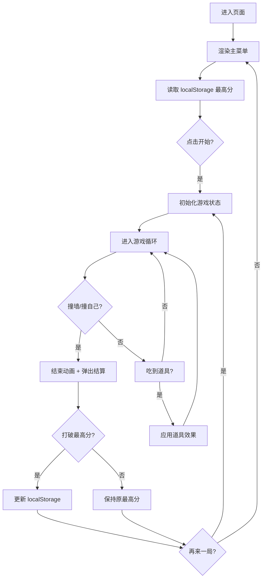

# 贪吃蛇小游戏 PRD（产品需求文档）

## 1. 产品概述
一款"柔和治愈风"的网页贪吃蛇游戏，主打马卡龙色系、圆角光影、轻松愉悦的视觉体验；蛇在 2D 画布内 **360° 自由移动**（非网格），支持手机/电脑自适应，自带经典模式、道具系统、本地最高分排行榜，开箱即玩。

- 核心目的：在网页端提供一款质感好、操控顺滑、视觉治愈的贪吃蛇游戏
- 目标用户：碎片时间想玩游戏放松的休闲玩家、追求视觉美感的玩家
- 产品价值：相比传统像素或硬核风格贪吃蛇，本产品以"温柔"差异化体验切入；2D 自由移动 + 360° 虚拟遥感的操控方式更接近 Slither.io 风格，但保持单局轻量

## 2. 核心功能

### 2.1 用户角色
不涉及多角色、无登录注册系统。玩家为匿名用户，所有数据（最高分）通过 `localStorage` 存储在本机。

### 2.2 功能模块
1. **开始/主菜单页**：游戏标题、操作说明、最高分展示、开始按钮
2. **游戏主页**：全屏游戏区、顶部 HUD（当前分数/最高分）、浮动虚拟遥感
3. **暂停与结束页**：暂停遮罩、Game Over 弹窗（最终分数、本局表现、再来一局按钮）

### 2.3 页面细节
| 页面名称 | 模块名称 | 功能描述 |
|---------|---------|---------|
| 主菜单页 | 标题与 Slogan | 显示游戏名、简单 slogan、按钮动效 |
| 主菜单页 | 历史最高分 | 从 `localStorage` 读取最高分并展示 |
| 主菜单页 | 操作说明卡片 | 列出"键盘 / 触屏 / 滑动"等不同设备的操作方式 |
| 游戏主页 | HUD | 顶部显示当前分数、长度、最高分；带玻璃拟态背景 |
| 游戏主页 | 游戏画布 | 占据视口主要区域，绘制蛇身、食物、网格 |
| 游戏主页 | 浮动方向键 | 触屏设备在右下/底部显示 4 向 D-Pad，可拖动 |
| 游戏主页 | 暂停按钮 | 右上角悬浮按钮，点击暂停 |
| 结束页 | 结算卡片 | 居中弹窗显示本局分数、是否破纪录、再来一局 |
| 结束页 | 返回菜单 | 返回主菜单 |

## 3. 核心流程

## 4. 用户界面设计

### 4.1 设计风格
- **主色板**（马卡龙色系）：
  - 背景：`#FFF4F0`（奶油粉）/ `#EAF4FF`（薄荷蓝）渐变
  - 蛇身：薄荷绿渐变 `#A8E6CF → #56C596`
  - 文字主色：`#5C5C77`（柔灰紫）
  - 强调色：蜜桃粉 `#FFB5A7`、柠檬黄 `#FCD5CE`、奶油黄 `#F8EDEB`
  - 道具色：樱桃红 `#FF8B94`、星空紫 `#C8B6FF`、落日橙 `#FFB347`
- **按钮**：圆角 16px，柔和投影 `0 8px 24px rgba(0,0,0,.06)`，hover 时阴影上浮 + 微微放大
- **字体**：标题使用 `Quicksand` 或 `Nunito`（圆润展示字），正文使用 `Nunito` 或系统无衬线
- **布局**：游戏画布始终全屏（按比例缩放为正方形/或按视口比例），HUD 与操控区浮动
- **图标/装饰**：使用 SVG 自绘可爱表情（蛇头笑脸、爱心道具），加 soft noise 纹理

### 4.2 页面设计概览
| 页面名称 | 模块名称 | UI 元素 |
|---------|---------|---------|
| 主菜单页 | 标题区 | 大号圆润字体"蛇来运转" + 副标题 + 漂浮表情气泡 |
| 主菜单页 | 最高分卡片 | 圆角白卡 + 玻璃拟态 + 金色奖杯 emoji |
| 主菜单页 | 开始按钮 | 大圆角主按钮，hover 时心跳缩放动画 |
| 游戏主页 | HUD | 顶部条状：左侧当前分 / 右侧最高分，圆角胶囊 |
| 游戏主页 | 画布背景 | 浅色棋盘格 + 圆角描边，气泡粒子缓慢漂浮 |
| 游戏主页 | 浮动 D-Pad | 半透明白底圆角，4 个方向按键，玻璃拟态 |
| 游戏主页 | 暂停按钮 | 右上角圆形按钮，悬停显示 tooltip |
| 结束页 | 结算弹窗 | 居中弹窗带弹簧动画进入，附庆祝粒子（破纪录时） |

### 4.3 响应式适配
- **桌面优先**，但**移动端自适应**
- 媒体查询断点：`>= 1024px` 桌面、`768-1023px` 平板、`< 768px` 手机
- 手机端：
  - 隐藏鼠标 hover 提示，显示虚拟 D-Pad
  - 启用滑动手势（在画布上左右上下滑动）
  - HUD 字号缩小
  - 防止双指缩放、禁止页面整体滚动（`touch-action: none`）
- 桌面端：
  - 显示键盘提示（方向键 / WASD）
  - 可选鼠标点击画布进行方向控制

### 4.4 3D 场景指引
不涉及 3D 场景，使用纯 2D Canvas 渲染。

## 5. 道具系统设计
- **普通食物**（🍓 樱桃红）：+10 分，蛇身+1
- **黄金食物**（🍋 柠檬黄）：+30 分，蛇身+2，且持续 5 秒"加速"效果
- **减速食物**（🫐 星空紫）：+5 分，蛇身+1，触发 5 秒"慢动作"
- **奖励食物**（⭐ 落日橙）：随机出现，+50 分 + 蛇身+3，10 秒后消失
- 道具出现频率：场上始终保持 1~3 个普通食物，黄金/减速/奖励按概率（约 5%/帧）出现
- 道具效果：吃到对应道具后，HUD 出现对应 buff 倒计时条

## 6. 操控策略（设备自适应）
启动时通过 `navigator.userAgent` 与 `'ontouchstart' in window` 联合判断：
- 触屏设备（手机/平板）→ 默认显示**虚拟遥感**，提供 360° 任意方向控制
- 桌面设备 → 默认隐藏遥感，主用 **键盘 WASD / 方向键**（8 向，含对角线）；同时支持鼠标拖拽遥感测试
- 同时绑定 `visibilitychange` 事件，自动暂停游戏（切后台不挂）
- 速度与活动区根据画布尺寸自适应；速度上限由 `baseSpeed` 控制（与画布短边成比例）

## 7. 性能与可访问性
- 帧率目标：60 FPS，使用 `requestAnimationFrame`
- 离屏 Canvas 预渲染静态背景
- 减少频繁 DOM 操作，状态变化走 CSS class
- 高对比度模式：在设置中提供"深色文本增强"开关
- 支持键盘 Tab 导航、ARIA 标签

## 8. 上线与发布
- 通过 GitHub Pages 部署（项目根目录静态站点）
- 部署前询问用户，让用户先在本地浏览器预览，确认无误后再 push 到 main 触发部署
