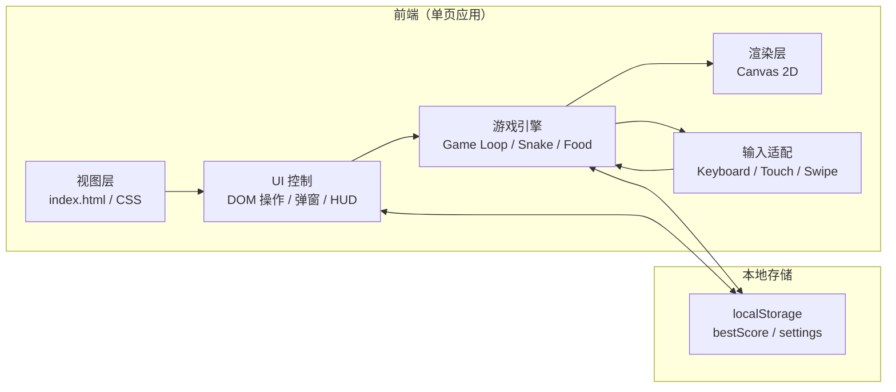
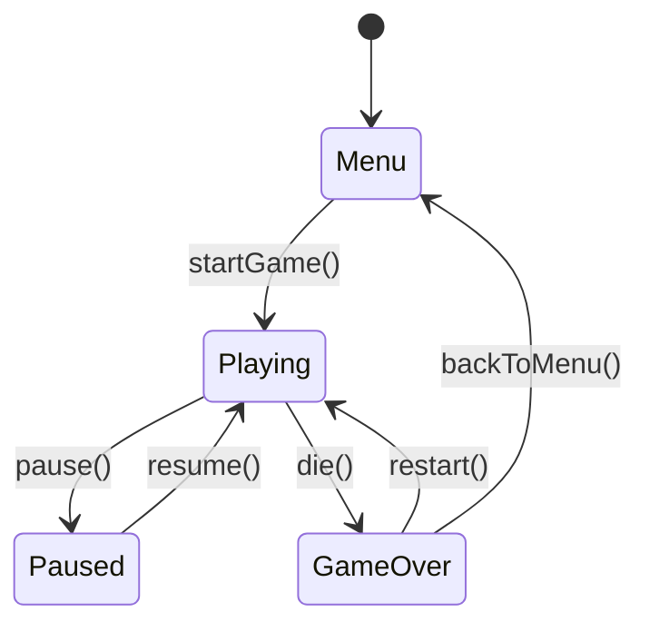

# 贪吃蛇小游戏 技术架构文档

## 1. 架构设计
纯前端单页应用（SPA），不涉及后端服务；数据存储使用 `localStorage`。



## 2. 技术选型
- **构建方式**：纯静态站点（HTML + CSS + JavaScript），无任何构建工具
- **理由**：项目规模小、零依赖部署简单、符合"开箱即玩"定位
- **第三方依赖**：
  - 字体：`Google Fonts`（Quicksand / Nunito）通过 CDN 引入
  - 图标：内联 SVG + 少量 Emoji
  - 不引入 Tailwind / React 等重框架
- **Canvas**：使用原生 `Canvas 2D` 渲染游戏画面

## 3. 目录结构
```
/workspace
├── index.html              # 入口 HTML
├── style.css               # 全局样式（响应式 + 设计系统）
├── script.js               # 入口脚本（启动、设备检测、路由）
├── game/
│   ├── engine.js           # 游戏主循环、状态机
│   ├── snake.js            # 蛇身逻辑、移动、碰撞
│   ├── food.js             # 道具生成、效果、生命周期
│   ├── input.js            # 键盘/触屏/滑动输入统一处理
│   ├── renderer.js         # Canvas 绘制（背景/蛇/食物/HUD 联动）
│   └── storage.js          # localStorage 读写封装
└── assets/
    └── (可选) SVG 表情资源
```

## 4. 核心模块设计

### 4.1 状态机


### 4.2 游戏循环
- 使用 `requestAnimationFrame` 驱动，按 `dt`（秒）增量更新
- 蛇为链式跟随：头部按当前 `angle` 方向以 `speed` 像素/秒推进；后续每节向其前节靠近并保持固定 `segmentSpacing` 像素距离
- 状态包括：snake（segments/angle/targetAngle/speed）、foods 数组、score、bestScore、activeBuffs

### 4.3 输入适配
- 键盘：`keydown` 监听 `ArrowUp/Down/Left/Right` 与 `WASD`
- 触屏：
  - 浮动 D-Pad：DOM 元素，touchstart 触发
  - 滑动手势：监听 `touchstart` / `touchend` 在画布上的 delta
- 自适应：启动时根据 `touch` 能力显示对应 UI

### 4.4 渲染流程
1. 清除画布
2. 绘制背景（离屏 canvas 预渲染的柔和渐变 + 漂浮斑点 + 虚线活动区边框）
3. 绘制食物（带光晕与脉动动画）
4. 绘制蛇身：粗线阴影 → 圆角主体 → 节间圆形鳞片 → 头部（径向渐变 + 眼睛 + 朝向的微笑）
5. 绘制过场动画（吃到食物的粒子效果、死亡抖动、白闪）

### 4.5 道具系统
- `Food` 类：`{ type, x, y, spawnAt, expiresAt, value, growth, buff }`
- 道具概率通过权重随机：`{ normal: 70, gold: 12, slow: 10, bonus: 8 }`
- buff 通过 `activeBuffs` Map 存储（type -> {remain, factor}），在游戏循环中倒计时

## 5. 数据模型
无数据库，仅 localStorage：

| Key | 类型 | 含义 |
|-----|------|-----|
| `snake.bestScore` | number | 历史最高分 |
| `snake.settings.dpadVisible` | boolean | 是否强制显示 D-Pad |
| `snake.settings.highContrast` | boolean | 高对比度模式 |

## 6. 响应式策略
- 使用 CSS 变量统一颜色与尺寸
- 媒体查询：
  - `@media (max-width: 768px)` 手机：HUD 缩小、强制显示 D-Pad
  - `@media (min-width: 769px) and (max-width: 1023px)` 平板：D-Pad 默认显示，键盘可关
  - `@media (min-width: 1024px)` 桌面：D-Pad 默认隐藏，键盘为主
- 画布尺寸：监听 `resize` 事件，按 `min(viewportW, viewportH - HUD)` 重新计算正方形尺寸并居中

## 7. 性能优化
- 食物与蛇身只在变化时重绘
- 背景层使用离屏 canvas 预渲染
- 节流 `resize` 事件（150ms debounce）
- 使用 CSS `transform` / `will-change` 提升动效性能
- 暂停时不消耗动画帧

## 8. 部署方案
- 静态文件托管：GitHub Pages（仓库根目录）
- 部署流程：
  1. 用户本地预览（`python3 -m http.server` 或直接打开 `index.html`）
  2. 用户确认无误
  3. 用户在 chat 内确认部署
  4. `git add . && git commit && git push origin main` 触发 `.github/workflows/static.yml` 自动部署
- 部署前**必须**经用户明确同意

## 9. 测试与验证
- 手动测试矩阵：桌面（Chrome/Safari/Firefox）、手机（iOS Safari/Chrome Android）
- 自检清单：
  - [ ] 主菜单→开始→游戏→结束流程通顺
  - [ ] 三种输入方式都能操控
  - [ ] 道具效果正常（HUD buff 条）
  - [ ] localStorage 最高分持久化
  - [ ] 切到后台自动暂停
  - [ ] 横竖屏切换布局正常
  - [ ] 触屏不出现页面缩放/滚动
